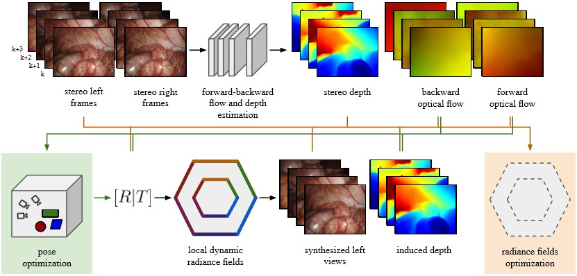

# FLex: Joint Pose and Dynamic Radiance Fields Optimization for Stereo Endoscopic Videos

### [Project Page](https://flexendo.github.io/)

[](https://arxiv.org/abs/2403.12198)

 

**FLex is a Dynamic Neural Radiance Fields method that jointly optimizes for reconstruction and camera poses from scratch. It partitiones a 4D scene into local models and optimizes following a progressive training scheme. Our approach allows for high quality scene reconstruction even under extremely changing topology while obtaining reasonable camera poses. In addition the scene partitioning allows for more robustustness towards longer and larger scenes than prior state-of-the-art methods.**

If you find this repository useful, please use the following BibTeX entry for citation.

```
@article{stilz2024flex,
  title={FLex: Joint Pose and Dynamic Radiance Fields Optimization for Stereo Endoscopic Videos},
  author={Stilz, Florian Philipp and Karaoglu, Mert Asim and Tristram, Felix and Navab, Nassir and Busam, Benjamin and Ladikos, Alexander},
  journal={arXiv preprint arXiv:2403.12198},
  year={2024}
}
```

Some aspects of this work also incorporate code, and in the case of the former, data as well (StereoMIS Dataset): [Robust Camera Pose Estimation for Endoscopic Videos](https://github.com/aimi-lab/robust-pose-estimator) and [RAFT](https://github.com/princeton-vl/RAFT). Both projects are released under the BSD-3-Clause license. If you use or redistribute their code, please comply with their licensing terms and cite them in your publications.

```
@article{hayoz2023pose,
title={Learning how to robustly estimate camera pose in endoscopic videos},
author={Michel Hayoz, Christopher Hahne, Mathias Gallardo, Daniel Candinas, Thomas Kurmann, Max Allan, Raphael Sznitman},
journal={International Journal of Computer Assisted Radiology and Surgery 2023}
doi={https://doi.org/10.1007/s11548-023-02919-w}
}
```

```
@inproceedings{teed2020raft,
  title={Raft: Recurrent all-pairs field transforms for optical flow},
  author={Teed, Zachary and Deng, Jia},
  booktitle={Computer Vision--ECCV 2020: 16th European Conference, Glasgow, UK, August 23--28, 2020, Proceedings, Part II 16},
  pages={402--419},
  year={2020},
  organization={Springer}
}
```


If you have any questions, please feel free to email me at florian.stilz@tum.de.

# Environment Setup
```
    # create conda environment
    conda create --name flex python=3.8
    
    # activate env
    conda activate flex

    # install pytorch
    pip install torch==2.1.0 torchvision==0.16.0 torchaudio==2.1.0 --index-url https://download.pytorch.org/whl/cu121

    # install lietorch
    pip install git+https://github.com/princeton-vl/lietorch.git

    # install additional requirements
    pip install -r requirements.txt

```
# StereoMIS FLex NeRF Dataset (Coming Soon)

The link to download the official dataset used in this work. Follow the instructions noted there to setup the dataset for training FLex.

# Custom Dataset Setup

1. Creata a folder called "data" in the root directory
2. Place your data within the "data" folder and ensure adding a "sequences.txt" also into each individual dataset folder file similar to the [StereoMIS](https://github.com/aimi-lab/robust-pose-estimator?tab=readme-ov-file) dataset 
3. Each individual subdata folder should consist of all scene folders which all need to contain a "StereoCalibration.ini" file containing the camera intrinsics information + left to right image relation for stereo images/videos similar to the [StereoMIS](https://github.com/aimi-lab/robust-pose-estimator?tab=readme-ov-file) dataset
4. Additionally, a video file in .mp4 format should be included for each scene for the video datasets or two folders called "left_images" and "right_images" for image datasets

# Preprocess Video Dataset

1.
```
cd Robust-Pose/scripts
python preprocess_video_data.py data/video_dataset_name
```

2.
Optional: If no tool masks are contained in the dataset, run the following command to generate empty masks:

```
python generate_empty_masks.py --data_dir data/video_dataset_name/scene
```

3.
Afterwards we preprocess the rectified stereo image sequences to obtain stereo depth and forward, backward optical flow information via [RAFT](https://github.com/princeton-vl/RAFT), as well as pose estimation from the [Robust-Pose Estimation](https://github.com/aimi-lab/robust-pose-estimator?tab=readme-ov-file) model.

```
python infer_trajectory.py data/video_dataset_name/scene --config ../configuration/infer_f2f.yaml
```

Please make sure that there are no duplicates in the freiburg.trajectory at the first position if the sequence does not start with index 0.

4.
Important: If the images were adjusted via additional cropping operations to fit into the U-Net of the Robust-Pose Estimation model, then two additional folders will be added to the data/subdata/scene folder called "adj_video_frames" and "adj_masks". Please replace the initial "video_frames" and "masks" files with the new ones and make sure that during the next step the image dimensions are specified.

5.
Generate transforms files which are used as direct data input to FLex:

```
cd ..
cd ..
python flex/dataloader/preprocess_data.py --scene 'scene_name' --data_type 'stereomis' --flow_data --tool_mask
```


# Preprocess Image Dataset

1.
```
cd Robust-Pose/scripts
python preprocess_image_data.py data/image_dataset_name
```

2.
Optional: If no tool masks are contained in the dataset, run the following command to generate empty masks:

```
python generate_empty_masks.py --data_dir data/video_dataset_name/scene
```
3.
Afterwards we preprocess the rectified stereo image sequences to obtain stereo depth and forward, backward optical flow information via [RAFT](https://github.com/princeton-vl/RAFT), as well as pose estimation from the [Robust-Pose Estimation](https://github.com/aimi-lab/robust-pose-estimator?tab=readme-ov-file) model.

```
python infer_trajectory.py data/image_dataset_name/scene --config ../configuration/infer_f2f.yaml
```

Please make sure that there are no duplicates in the freiburg.trajectory at the first position if the sequence does not start with index 0.

4.
Important: If the images were adjusted via additional cropping operations to fit into the U-Net of the Robust-Pose Estimation model, then two additional folders will be added to the data/subdata/scene folder called "adj_video_frames" and "adj_masks". Please replace the initial "video_frames" and "masks" files with the new ones and make sure that during the next step the image dimensions are specified.

5.
Generate transforms files which are used as direct data input to FLex:

```
cd ..
cd ..
python flex/dataloader/preprocess_data.py --scene 'scene_name' --data_type 'stereomis' --flow_data --tool_mask
```

# Train FLex

For training FLex make sure to adjust the desired config files + adding the correct data path under "data.data_dir"
```
python main.py config=config/dataset_name/FLex_scene_name.yaml
```

Alternatively, one can run a bash script via running the following line and by making sure that the .sh file contains the correct python command similar to above:
```
sbatch train_flex.sh
```


# Evaluating Test Views
For inference set `render_only=True`. With `render_test=True`, results at test viewpoints are automatically evaluated and validation viewpoints are generated after reconstruction.  

```
python main.py config=config/dataset_name/scene_name.yaml systems.ckpt="checkpoint/path" render_only=True render_test=True
```

# Evaluating New Known Test Views
For inference set `render_only=True`. Furthermore set `render_new_poses=True` and provide a .freiburg file with the desired poses to the `new_pose_file` command. Make sure that the timestamps in the .freiburg file are identical to the train and test frame indexes indicating the timestep that the specified pose should be rendered at.  

When using a FLexPO model, where the poses are trained from scratch, one has to run the following command first to convert the trained poses to .freiburg format.

```
python flex/dataloader/convert_flex_poses.py --input_dir "file_directory_location" --out_dir "new_freiburg_directory_location" --data_dir "path/datadir"
```

The actual inference script is displayed in the next line:

```
python main.py config=config/dataset_name/scene_name.yaml systems.ckpt="checkpoint/path" render_only=True render_new_poses=True new_pose_file="path/new_pose_file.freiburg"
```

Our code is influenced by [HexPlane](https://github.com/Caoang327/HexPlane), [LocalRF](https://github.com/facebookresearch/localrf), and many other projects.
We would like to acknowledge them for making great code openly available for us to use.
